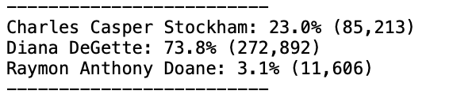

# Election Analysis

### Overview

##### Initial Approach

We were assigned the job of performing an audit of tabulated election results for a Congressional precinct in Colorado. We were orginally tasked with reporting the total of votes cast, the total of votes per candidate, the percentage of votes for each candidate, and finally, declaring the winner of the race based on popular vote.

##### Data Automation

Tabulated data in this case, stored in .csv format, is comprised of a long list of name, last name, county where each individual voted, as well as their respective ballot ID.  While an analysis like this could be performed using Excel for a small precinct, *automating data analysis using Python* can provide for a more comprehensive backdrop in which to perform wider-reaching searches, as well as enabling the possibility of reproducing the use of generated codes for vote count and analysis of larger areas, in Senatorial races, other local elections, and more.

##### Further Analysis

With effective coding methods using Python, we were able to create a powerful tool that generated an organized, clear .txt document that contained all of the election results and percentages, satisfying the inital job with which we were tasked. 

Down the line, we were asked to provide additional analysis on voter turnout per county, the percentage of votes that were tabulated from each county out of the total count, as well as the county with the highest turnout. 

Adding these functions to our original code was fairly easy, demonstrating the *efficacy and functionality* of the role of using Python to perform data analysis is wider and more encompassing ways.


### Election-Audit Results 

Aside from the initial information we were tasked with reporting, there were multiple infer additional answers which we are able to provide by analyzing the election-audit results using our code, as seen as  listed items in the final .txt file we provided:


In the bulleted items below, we will break down the answers to each question about the results obtained, and how we were able to achieve them using Python coding.

This is how we initialized our code:

We added our dependencies, namely importing the .csv dataset, and the Operating System (OS) with which to interact. We added variables to hold instructions indicating the path  to load the .csv file; as well as instructions on creating a .txt file where to replicate the output from our code:

```
\# Add our dependencies.

import csv

import os

\# Add a variable to load a file from a path.

file_to_load = os.path.join("Resources", "election_results.csv")

\# Add a variable to save the file to a path.

file_to_save = os.path.join("Analysis", "election_analysis.txt")
```


- **How many votes** were cast in this congressional election?

  - A total of **369,711 votes** were cast in this Congressional election.

  - Here is a screenshot of that number, as seen in our final .txt file:

    

  - In order to arrive at this result, we used a coding function. Here are some snippets of that function, extracted from the totality of the code: 

    1. We initialized a variable to hold the vote count:

       ```
         \# Initialize a total vote counter.
       
       total_votes = 0
       ```

    2. We initialized a variable to reference the information we are reading from the data contained in our .csv file throughout the entire code:

       ```
       \# Read the csv and convert it into a list of dictionaries
       
       with open(file_to_load) as election_data:
       
       	reader = csv.reader(election_data)
       	
       	\# Read the header
       
       	header = next(reader)
       ```

     3. We created a *for loop* that iterated through each row and extracted the total votes, adding to the vote count variable:

          ```
          \# For each row in the CSV file.
          
          		for row in reader:
          
          \# Add to the total vote count
          
          		total_votes = total_votes + 1
          		
          ```

      4. We saved the results to our .txt file and wrote an *f string* that also preempted the following line to be printed, the title to 'County Votes', printing to terminal and saving to the .txt file:

              \# Save results to our .txt file:
              with open(file_to_save, "w") as txt_file:
              # Print the final vote count (to terminal)
              election_results = (
                  f"\nElection Results\n"
                  f"-------------------------\n"
                  f"Total Votes: {total_votes:,}\n"
                  f"-------------------------\n\n"
                  f"County Votes:\n")
              print(election_results, end="")
              
              txt_file.write(election_results)


- Provide a breakdown of the number of votes and the percentage of total votes for each county in the precinct.

  - Here is a screenshot of the breakdown containing the number of votes and percentage of votes that were counted for each county, as seen in our final .txt file:

    

  - On the coding end, the way we arrived at this breakdown was the following:

    1. As we iterated through the rows using our *for loop*, we extracted the County name:

       ```
       \# Extract the county name from each row.
       
       	 county_name = row[1]
       ```

    2. Using an *if statement*, we compiled the list of county names from the list and the vote count for each of the counties into a Python dictionary. We then printed to terminal and saved in our .txt file:
               ```
               \# Write an if statement that checks that the
               \# county does not match any existing county in the county list.
               if county_name not in county_list:
               
                   \# Add the existing county to the list of counties.
                   county_list.append(county_name)
           
                   \# Begin tracking the county's vote count.
                   county_votes[county_name] = 0
           
               \# Add a vote to that county's vote count.
               county_votes[county_name] += 1
               
               \#Print the county results to the terminal.
               print(county_results)
               
                #Save the county votes to a text file.
               txt_file.write(county_results)
               ```
         
    3. Finally, using a *for loop* to iterate through the dictionary containing the names of the counties and the total votes,  retrieving each county name and its respective vote count, calculating the percentage of votes in each county, and writing an *f string* that concatenated all that information, printing to terminal and then saving into our .txt file:

           \# Write a for loop to get the county from the county dictionary.
           for county_name in county_votes:
               
               # Retrieve the county vote count.
               county_vote = county_votes.get(county_name)
               
               # Calculate the percentage of votes for the county.
               county_percentage = float(county_vote) / float(total_votes) * 100
               county_results = (
                   f"{county_name}: {county_percentage:.1f}% ({county_vote:,})\n")  
               # Print the county results to the terminal.
                   print(county_results)
               # Save the county votes to a text file.
                   txt_file.write(county_results)


- Which county had the largest number of votes?

  - **Denver** was the county with the largest number of votes.

  - Here is a screenshot of the county with the largest number of votes, as seen in our final .txt file:

    

  - On the coding end, in order to obtain the county with the largest vote turnout, we wrote an *if statement* to determine the county with the largest turnout, printing it to terminal and saving into our .txt file:

         \# Write an if statement to determine the winning county and get its vote count.
         if (county_vote > largest_turnout):
                largest_turnout = county_vote
                largest_county = county_name
        
        # 7: Print the county with the largest turnout to the terminal.
        largest_county_turnout= (
            f"\n-------------------------\n"
            f"Largest County Turnout: {largest_county}\n"
            f"-------------------------\n")
        print(largest_county_turnout)


- Provide a breakdown of the number of votes and the percentage of the total votes each candidate received.

  - Here is a screenshot of the breakdown containing the number of votes and percentage of the total votes that for each candidate received, as seen in our final .txt file:
    

  - On the coding end, the way we arrived at this breakdown was the following:

    1. As we iterated through the rows using our *for loop*, we extracted the candidate name:

           \#Get the candidate name from each row.
           	candidate_name = row[2]

    2. Using an *if statement*, we iterated through the candidate options, adding to the list of candidate names, and started a variable to start the vote count for each of the candidates:

            \#If the candidate does not match any existing candidate add it to
            \# the candidate list
               if candidate_name not in candidate_options:
           
                   # Add the candidate name to the candidate list.
                   candidate_options.append(candidate_name)
           
                   # And begin tracking that candidate's voter count.
                   candidate_votes[candidate_name] = 0
           
               # Add a vote to that candidate's count
               candidate_votes[candidate_name] += 1

    3. Finally, using a *for loop* to iterate through the list of candidates and the total votes,  we retrieved each candidate name and their respective vote count, calculating the percentage of votes for each candidate, and writing an *f string* that concatenated all that information, printing to terminal and then saving into our .txt file:
            ```
           \#Save the final candidate vote count to the text file.
           
           for candidate_name in candidate_votes:
               # Retrieve vote count and percentage
               votes = candidate_votes.get(candidate_name)
               vote_percentage = float(votes) / float(total_votes) * 100
               candidate_results = (
                   f"{candidate_name}: {vote_percentage:.1f}% ({votes:,})\n")
           
               # Print each candidate's voter count and percentage to the
               # terminal.
               print(candidate_results)
               #  Save the candidate results to our text file.
               txt_file.write(candidate_results)
                ```


- Which candidate won the election, what was their vote count, and what was their percentage of the total votes?

  - Candidate **Diana DeGette** won the election with **272,892 votes** and **73.8% of the total votes**.

  - Here is a screenshot of the winner, vote count and percentage, as seen in our final .txt file:

    

  - On the coding end, in order to obtain the name of the winning candidate, we wrote an *if statement* to determine conditions using our pre-established variables that held values that had been collected throughout the code; and creating new ones to hold our results. We wrote an *f string* concatenating this final set of results, and then proceeded to print it to terminal and save into our .txt file:
         ```
         \#Determine winning vote count, winning percentage, and candidate.
         if (votes > winning_count) and (vote_percentage > winning_percentage):
                winning_count = votes
                winning_candidate = candidate_name
                winning_percentage = vote_percentage
        
        # Print the winning candidate (to terminal)
        winning_candidate_summary = (
            f"-------------------------\n"
            f"Winner: {winning_candidate}\n"
            f"Winning Vote Count: {winning_count:,}\n"
            f"Winning Percentage: {winning_percentage:.1f}%\n"
            f"-------------------------\n")
        print(winning_candidate_summary)
        
        # Save the winning candidate's name to the text file
        txt_file.write(winning_candidate_summary)
         ```


### Election-Audit Summary

As seen in this thorough run-down of the code we created to analyze the election-audit results, the programmatic approach to data analysis using Python for automation of the process - the most widely used language of these times -  renders a powerful tool which can be used for any election.

With some modifications, we would be able to provide a code that can be utilized in other election-audit analysis, with wider scopes and of varied proportions.

Here is what we could do to modify our code and enable it to further use:

- Import a different .csv file
- In a different race, our dataset might include more columns, containing for instance information about the state, or party affiliation. If so, we would need to create additional layers of code, each with *for loops* and its own *if statements* that would pertain to those new columns, extracting and comparing the information we need.
- When data is extracted that pertains to groups within groups - like counties within states, and states within the country, or party affiliations within states - comparative analysis can be made by adding specific functions using a relatively succinct number of lines of code.

In essence, the use of Python code as a tool for widening the scope and deepening the analysis of election result-audits constitutes a thorough, effective, reliable tool for this election and potentially many others.
